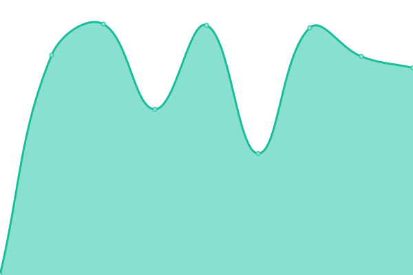
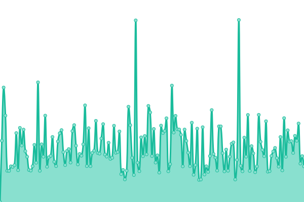
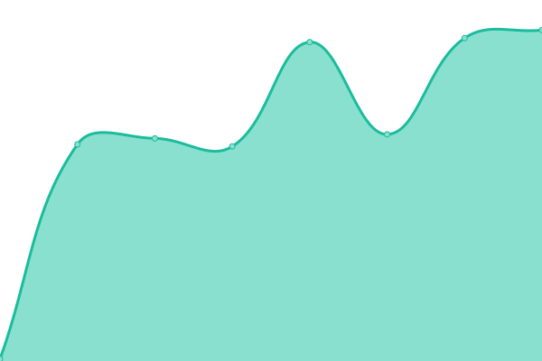

# [📈 Live Status](https://HPCSLab.github.io/upptime): <!--live status--> **🟩 All systems operational**

This repository contains the open-source uptime monitor and status page for [HPCS Lab 学生 org](https://www.hpcs.cs.tsukuba.ac.jp/), powered by [Upptime](https://github.com/upptime/upptime).

With [Upptime](https://upptime.js.org), you can get your own unlimited and free uptime monitor and status page, powered entirely by a GitHub repository. We use [Issues](https://github.com/HPCSLab/upptime/issues) as incident reports, [Actions](https://github.com/HPCSLab/upptime/actions) as uptime monitors, and [Pages](https://HPCSLab.github.io/upptime) for the status page.

<!--start: status pages-->
<!-- This summary is generated by Upptime (https://github.com/upptime/upptime) -->
<!-- Do not edit this manually, your changes will be overwritten -->
<!-- prettier-ignore -->
| URL | Status | History | Response Time | Uptime |
| --- | ------ | ------- | ------------- | ------ |
|  [Web Page](https://www.hpcs.cs.tsukuba.ac.jp) | 🟩 Up | [web-page.yml](https://github.com/HPCSLab/upptime/commits/HEAD/history/web-page.yml) | 

 2140ms
     
 | 

<a href="https://HPCSLab.github.io/upptime/history/web-page">96.34%</a>
    

|  [Internal Page](https://www.hpcs.cs.tsukuba.ac.jp/internal/pukiwiki/) | 🟩 Up | [internal-page.yml](https://github.com/HPCSLab/upptime/commits/HEAD/history/internal-page.yml) | 

 428ms
     
 | 

<a href="https://HPCSLab.github.io/upptime/history/internal-page">95.81%</a>
    

|  [Webmail](https://mail.hpcs.cs.tsukuba.ac.jp) | 🟩 Up | [webmail.yml](https://github.com/HPCSLab/upptime/commits/HEAD/history/webmail.yml) | 

 1880ms
     
 | 

<a href="https://HPCSLab.github.io/upptime/history/webmail">95.32%</a>
    

|  [Auth Server httpd](https://auth.hpcs.cs.tsukuba.ac.jp) | 🟩 Up | [auth-server-httpd.yml](https://github.com/HPCSLab/upptime/commits/HEAD/history/auth-server-httpd.yml) | 

 1332ms
     
 | 

<a href="https://HPCSLab.github.io/upptime/history/auth-server-httpd">90.20%</a>
    

|  [Mail (SMTP)](mail.hpcs.cs.tsukuba.ac.jp) | 🟩 Up | [mail-smtp.yml](https://github.com/HPCSLab/upptime/commits/HEAD/history/mail-smtp.yml) | 

 141ms
     
 | 

<a href="https://HPCSLab.github.io/upptime/history/mail-smtp">96.36%</a>
    

|  [Mail (SMTPS)](mail.hpcs.cs.tsukuba.ac.jp) | 🟩 Up | [mail-smtps.yml](https://github.com/HPCSLab/upptime/commits/HEAD/history/mail-smtps.yml) | 

 144ms
     
 | 

<a href="https://HPCSLab.github.io/upptime/history/mail-smtps">96.37%</a>
    

|  [Mail (IMAPS)](mail.hpcs.cs.tsukuba.ac.jp) | 🟩 Up | [mail-imaps.yml](https://github.com/HPCSLab/upptime/commits/HEAD/history/mail-imaps.yml) | 

 144ms
     
 | 

<a href="https://HPCSLab.github.io/upptime/history/mail-imaps">96.38%</a>
    

|  [Mail (POP3)](mail.hpcs.cs.tsukuba.ac.jp) | 🟩 Up | [mail-pop-3.yml](https://github.com/HPCSLab/upptime/commits/HEAD/history/mail-pop-3.yml) | 

 144ms
     
 | 

<a href="https://HPCSLab.github.io/upptime/history/mail-pop-3">96.39%</a>
    

|  [Mail (POP3S)](mail.hpcs.cs.tsukuba.ac.jp) | 🟩 Up | [mail-pop-3-s.yml](https://github.com/HPCSLab/upptime/commits/HEAD/history/mail-pop-3-s.yml) | 

 144ms
     
 | 

<a href="https://HPCSLab.github.io/upptime/history/mail-pop-3-s">96.41%</a>
    

|  [External DNS](dns.hpcs.cs.tsukuba.ac.jp) | 🟩 Up | [external-dns.yml](https://github.com/HPCSLab/upptime/commits/HEAD/history/external-dns.yml) | 

 144ms
     
 | 

<a href="https://HPCSLab.github.io/upptime/history/external-dns">96.42%</a>
    

|  [Work SSH](work.hpcs.cs.tsukuba.ac.jp) | 🟩 Up | [work-ssh.yml](https://github.com/HPCSLab/upptime/commits/HEAD/history/work-ssh.yml) | 

 143ms
     
 | 

<a href="https://HPCSLab.github.io/upptime/history/work-ssh">96.42%</a>
    

<!--end: status pages-->

[**Visit our status website →**](https://HPCSLab.github.io/upptime)

## 📄 License

- Powered by: [Upptime](https://github.com/upptime/upptime)
- Code: [MIT](./LICENSE) © [Anand Chowdhary](https://anandchowdhary.com), supported by [Pabio](https://pabio.com)
- Data in the `./history` directory: [Open Database License](https://opendatacommons.org/licenses/odbl/1-0/)
